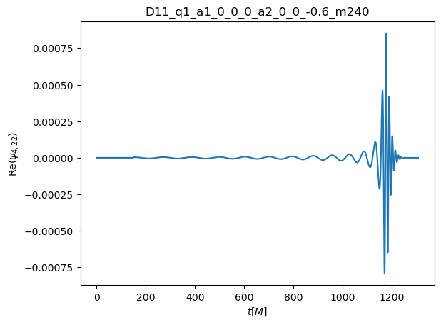
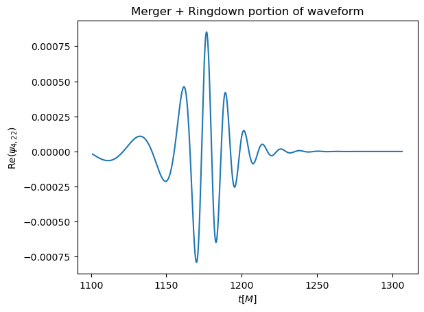
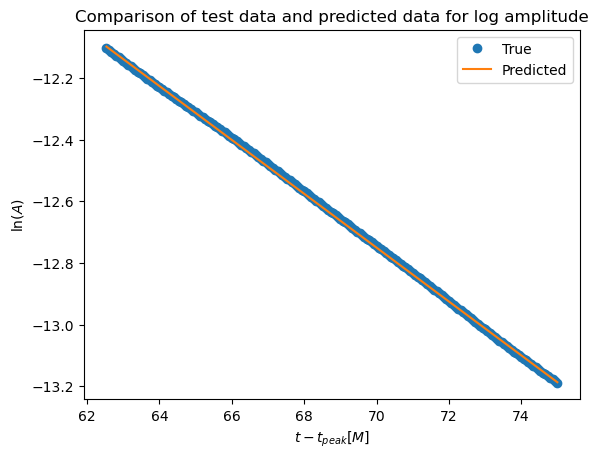
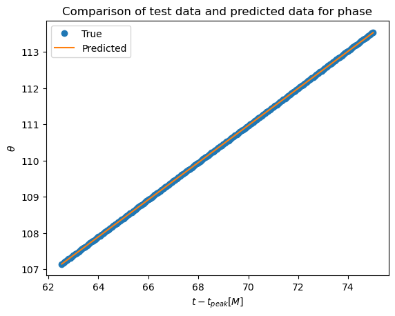
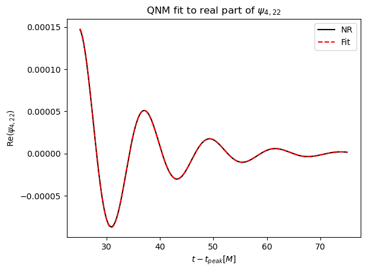

# Performing quasinormal fits to ringdown portion of gravitational waveforms

Final project for Computational Physics (PHY 381C Fall 2022)

Author: Hector Iglesias

##  Introduction
Gravitational waves are produced by a number of candidate sources, most notably the coalescence of a binary of black holes. The gravitational wave signal from such sources can be split into three pieces: inspiral, merger, and ringdown. The inspiral portion of the waveform corresponds to the waves emitted by the orbiting black holes. The signal is essentially sinusoidal, and the orbits of the system is well described by Newtonian dynamics. In the merger phase, the black holes are so close together that relativistic effects become important in describing the dynamics of the system. At this point, the frequency and amplitude of the waveform increase drastically, hence the <i>chirp</i> in the signal. After the two black holes have merged, a final distorted black hole is left in the aftermath. The ringdown phase of the waveform originates from this final black hole, whose distortions are dissipated away in the form of gravitational waves. The waveform in this phase resembles the ringing of a bell as the black hole is relaxing and settling down to its final state, hence the name ringdown.

In the ringdown regime, the resulting black hole is a single perturbed black hole characterized by two parameters: the final remnant mass $M$ and dimensionless spin $j$. This perturbed black hole radiates gravitational waves at a specific set of frequencies and timescales described by black hole perturbation theory. The set of frequencies and decay times are known as quasinormal modes (QNMs). These modes are modeled as exponentially damped sinusoids [1].

Black hole perturbation theory shows that the QNMs can be decomposed into spin-weighted spheroidal harmonics, which can be written as an expansion in spin-weighted spherical harmonics, with angular numbers $(\ell, m)$ and overtone number $n$, with $n=0$ being referred to as the fundamental mode. In the ringdown regime, the gravitational wave $\Psi_4$ is represented by a superpostion of QNMS:

$$
\Psi_{4_{(\ell',m')}} = \sum_{\ell m} \sum_{n=0} C_{\ell m n} e^{-t/\tau_{\ell m n}} e^{i (\omega_{\ell m n} t + \phi_{\ell m n})}
$$

where $\ell',m'$ are angular mode numbers for the gravitational wave. Each mode has a complex frequency $\omega$, whose real part is the oscillation frequency $\omega_{\ell m n} = Re(\omega)$, and whose imaginary part is the inverse of the decay time $\tau_{\ell m n} = Im (\omega)^{-1}$. These values are uniquely determined by the mass $M$ and dimensionless spin $j$ of the final black hole. 

In the paper <i>On gravitational-wave spectroscopy of massive black holes with the space interferometer LISA</i> [2], the real and imaginary parts of the complex QNM frequencies for different values of $j$ are tabluated in Appendix E. These numerical values have been fitted to reasonable accuracy to simple functions that can be inverted to to determine $M$ and $j$ once the QNM frequencies are known. The fitting functions have the form

$$
F_{\ell m n} = M \omega_{\ell m n} = f_1 + f_2 (1-j)^{f_3}
$$

$$
Q_{\ell m n} = \pi f_{\ell m n} \tau_{\ell m n} = q_1 + q_2 (1-j)^{q_3}
$$

where $f_i,q_i$ for $i=1,2,3$ are fitting coefficients tabulated in Appendix E and $f_{\ell m n} = \frac{\omega{\ell m n}}{2 \pi}$.

Throughout this work, we will only focus on a single QNM. The motivation for this is that it would allow us to perform linear fits on the (log) amplitude and phase of the waveform in the ringdown regime. To see this, let us use the $\ell=2,m=2,n=0$ QNM as an example. The gravitational waveform in the ringdown regime will then take the approximant form

$$
\Psi_{4_{(2,2)}} = A_{22} e^{i \theta_{22}} \approx C_{220} e^{-t/\tau_{220}} e^{i (\omega_{220} t + \phi_{220})}
$$

where $A_{22}$ is the amplitude and $\theta_{22}$ is the gravitational wave phase. Using the Mayawaves library, we can focus on the amplitude and phase of the gravitational waveform separately. Then, we can perform linear fits on the log amplitude of the waveform

$$
\text{ln} A_{22} = \text{ln} C_{220} - \frac{1}{\tau_{220}} t
$$

as well as its phase

$$
\theta_{22} = \omega_{220} t + \phi_{220}
$$

From these linear fits, we can determine the real and imaginary parts of the complex QNM frequency, and after inserting these into the fitting functions described above, we can recover the final black hole's mass and dimensionless spin. 

## Setup
Mayawaves is a python library developed by Deborah Ferguson that allows us to interact with data produced from the MAYA version of Einstein Toolkit. Einstein Toolkit is an open-source software platform of computational tools that is used in gravitational physics research, primarily for simulating mergers of compact objects such as black holes. MAYA is a particular version of the code developed by Dr. Deirdre Shoemaker's group at UT Austin. The Mayawaves library is very useful to visualize the gravitational waveforms created from these MAYA simulations.

At this point in time, Mayawaves has not been released to the public, so I cannot provide information on setting up the mayawaves environment.However, the library is expected to be released to the public soon, and once this happens, this page will be updated with information on setting up the library as well as a link to the library's documentation.

## Notebook
This notebook searches for the best starting time of the quasinormal mode of interest by performing linear fits on the log amplitude and phase of the gravitational waveform. After obtaining the best starting time—corresponding to the highest $R^2$ score—a linear fit is performed one last time to obtain the quasinormal mode frequency and decay time. Using this information, the estimated final mass and dimensionless spin of the remnant black hole is calculated and compared to the values obtained from the black hole's apparent horizon at the end of the simulation.

To start with, the notebook needs to work with gravitational wave data from a BBH simulation. The Center of Gravitational Physics at UT Austin has simulated gravitational wave data from a variety of simulations in the form of .h5 files. These .h5 files can be downloaded from the Waveforms page on the main website: https://sites.cns.utexas.edu/cgp/waveform. After specifying the simulation to be analyzed as well as the mode of interest, the notebook will produce plots of the entire waveform and the merger+ringdown portion of the waveform.

Quasinormal modes are not expected to all start at the same time, and they are not expected to turn on at the time of merger, so an optimal start time needs to be chosen. This optimal start time of the QNM is determined by performing linear fits of the log amplitude and the phase and searching for the start time that results in the fit with the highest $R^2$ score. While ringdown is assumed to start after merger, there is no reason that QNMs are excluded from appearing before merger, so the range of start times has been written with this in mind. In the notebook, the start times range from [-25, 25], where the values are the start times are the time after merger (the time array has its values shifted so that $t_{\text{merger}}$ is at 0), but this range can be changed. 

For each start time, the data is truncated to a width of 50 $M$, where $M$ is the total mass and serves as the units for time in the simulation. The truncated data is split into training data (50%), validation data (25%), and test data (25%). A linear regression model is trained on the training data, and using this model, a prediction is made using time values from the validation dataset. From this prediction, an $R^2$ score is computed on the validation dataset. This $R^2$ is then appended to a dictionary with the start time as its key. At the end of the loop, the start time corresponding to the largest $R^2$ score is picked out, and this is the optimal start time for the QNM.

After obtaining the optimal start time, a single iteration of the loop is performed using this start time. However, this time the data is split into training data (75%) and test data (25%). A linear regression model is trained on the training data, and using this model, a prediction is made using time values from the test dataset. From this prediction, an $R^2$ score is computed on the test dataset. The resulting $R^2$ value is the score for the model.

Using Emanuele Berti's fitting functions [2], the estimated final mass and dimensionless spin of the simulation's remnant black hole is calculated. This is done by inserting the values for $\omega_{\ell m n}$ and $\tau_{\ell m n}$ obtained from the linear fits using the optimal start time into the fitting functions and solving for the remnant mass and spin.

Since the .h5 file also contains information about the apparent horizons of the initial pair of black holes and the remnant black hole, the mayawaves library can be used to calculate the mass and dimensionless spin of the remnant black hole using its apparent horizon. The values obtained from the apparent horizon and the fitting functions are compared to each other.

Lastly, the ringdown portion of the waveform is reconstructed using the amplitude, phase shift, frequency, and decay time obtained from the final linear regression. The fractional root-mean-square error of the reconstructed fit when compared to the original waveform is also calculated.

## References

* [1] Giesler, M., Isi, M., Scheel, M. A., and Teukolsky, S. A., “Black Hole Ringdown: The Importance of Overtones”, <i>Physical Review X</i>, vol. 9, no. 4, 2019. doi:10.1103/PhysRevX.9.041060.
* [2] Berti, E., Cardoso, V., and Will, C. M., “Gravitational-wave spectroscopy of massive black holes with the space interferometer LISA”, <i>Physical Review D</i>, vol. 73, no. 6, 2006. doi:10.1103/PhysRevD.73.064030.
